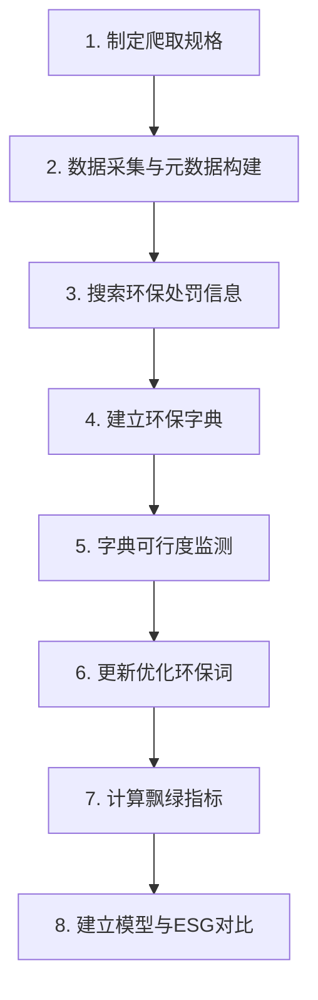
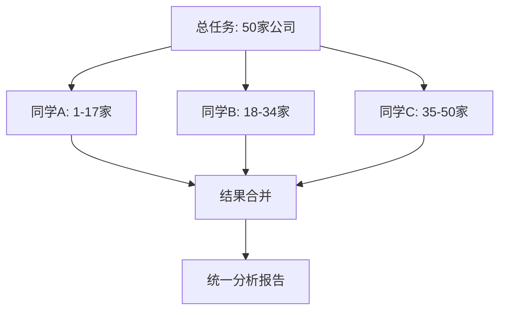

# 上市公司漂绿分析完整流程

本Skill提供完整的上市公司漂绿行为分析流程，从数据采集到最终模型构建，帮助用户复现整个研究过程。

## 流程概览



---

## 步骤详解

### 步骤1：制定爬取规格

**目标**：明确数据采集范围、时间、关键词等参数

**参考文件**：`/Users/ami/Desktop/巨潮网作业/工作流程/crawl_spec.md`

**关键内容**：
- 股票池：17家上市公司（钢铁、煤炭、化工、有色金属行业）
- 时间范围：2013-2024年（共12年）
- 报告类型：年报、ESG报告、社会责任报告
- 公告关键词：年度报告、ESG报告、社会责任报告、环境报告书
- 限速策略：每请求间隔3-8秒，单线程，日请求≤3000次

**执行命令**：
```bash
# 查看爬取规格
cat /Users/ami/Desktop/巨潮网作业/工作流程/crawl_spec.md
```

---

### 步骤2：数据采集与元数据构建

**目标**：从巨潮资讯网下载年报PDF，转换为TXT，构建元数据文件

**输入**：爬取规格文档
**输出**：
- PDF文件：`downloads/{股票代码}_{公司名}/pdf/*.pdf`
- TXT文件：`downloads/{股票代码}_{公司名}/txt/*.txt`
- 元数据：`工作流程/metadata/metadata_with_urls.csv`

**元数据字段**：
| 字段 | 说明 |
|------|------|
| doc_id | 唯一标识 |
| stock_code | 股票代码 |
| company_name | 公司名称 |
| report_type | annual/esg |
| year | 报告年份 |
| title | 公告标题 |
| publish_date | 发布日期 |
| pdf_url | PDF下载链接 |
| local_pdf_path | 本地PDF路径 |
| download_status | success/failed |

**执行命令**：
```bash
# 运行爬虫脚本
python cninfo_scraper_v2.py

# 查看元数据
cat /Users/ami/Desktop/巨潮网作业/工作流程/metadata/metadata_with_urls.csv
```

---

### 步骤3：搜索环保处罚信息

**目标**：查找目标公司的环境行政处罚公告

**处罚报告类型**：
- 临时环境信息依法披露报告
- 关于收到生态环境局行政处罚决定书的公告
- 关于控股子公司收到环保处罚决定书的公告
- 年度报告中的环境行政处罚情况章节

**执行方式**：
在巨潮资讯网搜索关键词组合：
- `{股票代码} + 环境处罚`
- `{股票代码} + 环保处罚`
- `{股票代码} + 行政处罚 + 环境`

---

### 步骤4：建立环保字典

**目标**：构建4个关键词字典用于文本分析

**字典文件位置**：`/Users/ami/Desktop/巨潮网作业/标绿/`

| 字典文件 | 用途 | 关键词数 |
|----------|------|----------|
| 环保字典.csv | 环境关键词基础库 | 62个 |
| 模糊词汇扩展表——人工标注.csv | 模糊表述识别 | 77个 |
| 正面词汇扩展表——人工标注.xls | 正面宣传强度 | 24个 |
| 新证据词汇扩展表——人工标注.csv | 证据密度计算 | 55个 |

**构建方法**：
1. 从年报中提取核心环保词汇
2. 使用腾讯词向量模型扩展相似词
3. 人工筛选精简，去除无关词
4. 分类整理为4个词库

**关键词示例**：
- 环保词：环境、环保、绿色、低碳、碳中和、排放、污染
- 模糊词：努力、积极推进、逐步、持续、大力、不断
- 正面词：优秀、领先、卓越、标杆、创新、高质量
- 证据词：ISO14001认证、碳核查、环保验收、第三方审计

---

### 步骤5：字典可行度监测

**目标**：验证字典的有效性和标注一致性

**方法**：
1. 根据环保字典定位200句环保相关句子
2. 人工标注3个维度：
   - vague（表述是否模糊）
   - quant（是否有数字量化）
   - positive_no_evidence（是否正面宣传但不给证据）
3. 计算标注一致性（Inter-rater Agreement）

**标注文件**：`/Users/ami/Desktop/巨潮网作业/环境句子抽取_基于报告词汇.csv`

**一致性指标**：
- Cohen's Kappa ≥ 0.6 为可接受
- 如一致性过低，需重新调整字典

---

### 步骤6：更新优化环保词

**目标**：根据监测结果优化字典

**优化策略**：
- 移除歧义大的词汇
- 补充遗漏的高频环保词
- 调整词汇权重（相似度评分）

**更新后的字典**：
- 环保关键词扩展至200+个
- 覆盖16个维度：环境基础、ESG、污染、治理、设施、政策、处罚、能源、材料、生态、运营、管理、科技、社会责任、宏观政策、其他

---

### 步骤7：计算飘绿指标

**目标**：对每份报告计算6个飘绿相关指标

**核心函数**：`process_one_file(file_path, report_type, company, year)`

**6个指标说明**：

| 指标 | 公式 | 说明 |
|------|------|------|
| env_density | 环保关键词次数/总字符数×1000 | 环境信息披露密度 |
| vague_sent_ratio | 模糊句子数/总句子数 | 模糊表述比例 |
| quant_sent_ratio | 量化句子数/总句子数 | 量化披露比例 |
| has_investment | 是否有环保投入披露（0/1） | 实质性投入 |
| positive_intensity | 正面词次数/总字符数×1000 | 正面宣传强度 |
| evidence_per_page | 证据词次数/页数 | 证据密度 |

**执行脚本**：
```bash
python /Users/ami/Desktop/巨潮网作业/计算飘绿指标.py
```

**输出文件**：`/Users/ami/Desktop/巨潮网作业/标绿/greenwashing_results.csv`

**输出字段**：
- 公司、年份、报告类型
- 6个飘绿指标值
- 总字符数、总句子数

---

### 步骤8：建立模型与ESG评分对比

**目标**：构建漂绿识别模型，与第三方ESG评分对比验证

**综合指标计算**：
| 指标 | 公式 | 说明 |
|------|------|------|
| positive_gap | ESG正面密度 - 年报正面密度 | 正面宣传差异 |
| vague_gap | ESG模糊密度 - 年报模糊密度 | 模糊表述差异 |
| has_penalty | 该年前后2年内是否有处罚 | 实际违规情况 |
| greenwash_alert | positive_gap>0.2 且 vague_gap>0.2 且 has_penalty=True | 漂绿预警 |

**对比验证**：
1. 获取第三方ESG评分（如华证ESG、商道融绿）
2. 计算模型预测的漂绿风险分数
3. 对比分析：
   - 高ESG评分 + 高漂绿风险 = 潜在漂绿
   - 低ESG评分 + 低漂绿风险 = 一致
   - 高ESG评分 + 低漂绿风险 = 真实环保表现

---

## 步骤9：多人协作与结果合并

**目标**：支持多位同学协作完成50家公司的分析任务，并快速合并结果

**协作架构**：



**协作目录结构**：
```
协作结果/
├── 同学A/                    # 同学A负责的公司结果
│   └── greenwashing_results.csv
├── 同学B/                    # 同学B负责的公司结果
│   └── greenwashing_results.csv
├── 同学C/                    # 同学C负责的公司结果
│   └── greenwashing_results.csv
├── 合并结果/                 # 自动合并后的统一结果
│   ├── merged_greenwashing_results.csv
│   └── merge_report.md
└── merge_tool.py             # 合并工具脚本
```

**任务分配**：
| 同学 | 负责公司数量 | 公司列表 |
|------|-------------|----------|
| 同学A | 17家 | 荣盛石化、中国石化、恒力石化、海螺水泥、天山股份、晨鸣纸业、太阳纸业、山鹰国际 |
| 同学B | 17家 | 云南白药、鲁泰A、华孚时尚、科伦药业、复星医药、恒瑞医药、白云山、金隅冀东 |
| 同学C | 16家 | 剩余公司 |

**合并工具使用**：

```bash
# 1. 分配任务（首次协作）
python 协作结果/merge_tool.py --mode split --input 工作流程/metadata/metadata_with_urls.csv

# 2. 每位同学完成分析后，将结果放入对应目录
#    同学A → 协作结果/同学A/greenwashing_results.csv
#    同学B → 协作结果/同学B/greenwashing_results.csv  
#    同学C → 协作结果/同学C/greenwashing_results.csv

# 3. 合并结果
python 协作结果/merge_tool.py --mode merge

# 4. 查看合并报告
cat 协作结果/合并结果/merge_report.md
```

**合并工具功能**：
- 自动识别三位同学的结果文件
- 智能去重（按公司、年份、报告类型）
- 生成统计报告（公司分布、指标摘要、来源分布）
- 输出统一格式的合并结果

---

## 文件结构

```
/Users/ami/Desktop/巨潮网作业/
├── 工作流程/
│   ├── crawl_spec.md                    # 爬取规格说明书
│   ├── workflow_design.md               # 工作流设计文档
│   └── metadata/
│       └── metadata_with_urls.csv       # 元数据文件（含URL）
├── downloads/                           # 下载的报告文件
│   ├── {股票代码}_{公司名}/
│   │   ├── pdf/*.pdf                    # PDF原件
│   │   └── txt/*.txt                    # TXT文本
├── 标绿/                                # 字典与结果
│   ├── 环保字典.csv
│   ├── 模糊词汇扩展表——人工标注.csv
│   ├── 正面词汇扩展表——人工标注.xls
│   ├── 新证据词汇扩展表——人工标注.csv
│   ├── greenwashing_components.csv      # 参考指标示例
│   └── greenwashing_results.csv         # 计算结果
├── 协作结果/                            # 多人协作目录
│   ├── 同学A/                           # 同学A结果
│   ├── 同学B/                           # 同学B结果
│   ├── 同学C/                           # 同学C结果
│   ├── 合并结果/                        # 合并后结果
│   └── merge_tool.py                    # 合并工具
├── 环境句子抽取_基于报告词汇.csv         # 人工标注数据
├── build_env_corpus_v2.py               # 环保语料库构建脚本
├── 计算飘绿指标.py                       # 飘绿指标计算脚本
└── 环保语料库构建操作记录.md             # 操作记录文档
```

---

## 快速复现指南

### 场景一：单人复现（已有数据）
```bash
# 1. 环境准备
pip install pandas requests xlrd

# 2. 直接运行指标计算（已有17家公司数据）
python 计算飘绿指标.py

# 3. 查看结果
cat 标绿/greenwashing_results.csv | head -20
```

### 场景二：多人协作（50家公司）
```bash
# 1. 初始化协作环境
mkdir -p 协作结果/{同学A,同学B,同学C,合并结果}

# 2. 任务分配
python 协作结果/merge_tool.py --mode split \
  --input 工作流程/metadata/metadata_with_urls.csv

# 3. 每位同学执行（并行）
# 同学A: 处理分配的公司
python 计算飘绿指标.py --company-list 协作结果/同学A/同学A_metadata.csv

# 同学B: 处理分配的公司  
python 计算飘绿指标.py --company-list 协作结果/同学B/同学B_metadata.csv

# 同学C: 处理分配的公司
python 计算飘绿指标.py --company-list 协作结果/同学C/同学C_metadata.csv

# 4. 复制结果到对应目录
cp 标绿/greenwashing_results.csv 协作结果/同学A/

# 5. 合并结果
python 协作结果/merge_tool.py --mode merge

# 6. 查看合并报告
cat 协作结果/合并结果/merge_report.md
```

### 场景三：老师快速验证
```bash
# 方式1：直接查看合并结果
cat 协作结果/合并结果/merged_greenwashing_results.csv

# 方式2：运行完整流程验证
python 计算飘绿指标.py
python 协作结果/merge_tool.py --mode merge

# 方式3：生成统计摘要
python -c "
import pandas as pd
df = pd.read_csv('协作结果/合并结果/merged_greenwashing_results.csv')
print('总公司数:', df['公司'].nunique())
print('总报告数:', len(df))
print('指标均值:\n', df[['env_density', 'vague_sent_ratio', 'quant_sent_ratio', 
                        'positive_intensity', 'evidence_per_page']].mean())
"
```

### 验证命令
```bash
# 检查文件完整性
ls -la downloads/ | wc -l
ls -la 标绿/

# 检查结果格式
head -5 协作结果/合并结果/merged_greenwashing_results.csv

# 检查指标统计
python -c "
import pandas as pd
df = pd.read_csv('协作结果/合并结果/merged_greenwashing_results.csv')
print(df.describe())
"
```

---

## 关键参数配置

### 爬虫参数（crawl_spec.md）
- 时间范围：2013-2024
- 公司数量：17家（可扩展至50家）
- 报告类型：年报 + ESG/CSR报告
- 限速：3-8秒间隔，单线程

### 字典参数
- 环保关键词：200+个（16维度）
- 模糊词汇：77个（相似度≥0.55）
- 正面词汇：24个（高质量、领先等）
- 证据词汇：55个（认证、核查、审计等）

### 指标阈值
- env_density：正常范围 1-15
- vague_sent_ratio：漂绿预警 > 0.05
- quant_sent_ratio：可信披露 > 0.3
- positive_intensity：过度宣传 > 2.0
- evidence_per_page：证据充分 > 0.1

---

## 常见问题

### Q1：字典一致性过低怎么办？
调整模糊词汇的定义，移除歧义大的词，增加明确的量化标准。

### Q2：PDF转TXT质量不佳？
使用MinerU或Adobe Acrobat重新转换，检查乱码率≤20%。

### Q3：指标计算结果异常？
检查：
1. TXT文件是否完整
2. 字典编码是否正确（GB18030/UTF-8）
3. 正则表达式是否匹配到数字+单位

### Q4：如何扩展到更多公司？
修改crawl_spec.md中的股票池，重新运行爬虫脚本。

---

## 参考文档

- 爬取规格：`工作流程/crawl_spec.md`
- 工作流设计：`工作流程/workflow_design.md`
- 操作记录：`环保语料库构建操作记录.md`
- 参考论文：`飘绿一：语料库构建/中小股东监督与漂绿治理——基于词向量模型的文本分析_沈弋.pdf`

---

## 输出成果

1. **元数据文件**：279份报告的完整元数据
2. **环保语料库**：64,779条环保相关语句
3. **飘绿指标表**：17家公司×12年×2类型的6指标数据
4. **漂绿风险报告**：综合评分与ESG对比分析

---

**创建日期**：2026年6月8日  
**适用场景**：上市公司漂绿行为研究、环境信息披露分析、ESG评分验证