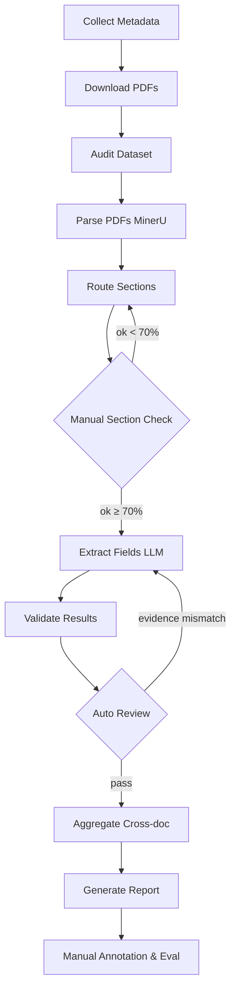

# Workflow Design — 上市公司漂绿分析

## 1. 项目目标

从巨潮资讯网（CNINFO）获取目标公司的 **年报、ESG报告（社会责任报告）、环保处罚公告** PDF，通过 NLP + LLM 抽取字段，计算"漂绿"代理指标，最终输出每家公司每年份的漂绿风险评估报告。

**核心逻辑：** ESG 报告正面语调 > 年报正面语调 + 模糊表述比例高 + 实际有环保处罚 = 漂绿嫌疑。

## 2. 总流程图



## 3. 节点表

每个节点包含五要素：**输入 → 输出 → 成功标准 → 失败处理 → 日志**

| 节点 | 输入 | 输出 | 成功标准 | 失败处理 | 日志 |
|------|------|------|---------|---------|------|
| **collect_metadata** | 巨潮API关键词+日期 | `metadata.csv` | ≥150条公告, 每公司≥1组完整事件 | 记录不可达公司 | ✅ |
| **download_pdfs** | `metadata.csv` | `data/pdf/*.pdf` | 成功率 >95% | 重试2次→标记失败 | ✅ |
| **audit_dataset** | `metadata.csv`, PDF目录 | `audit_report.csv` | 无缺失必填字段, PDF可读性OK | 生成异常清单 | ✅ |
| **parse_pdfs** | PDF文件 | `parsed_docs.jsonl`, `markdown/*.md` | 抽样20份乱码率≤20% | 重试2次→标记parse_error | ✅ |
| **route_sections** | `parsed_docs.jsonl` | `sections.jsonl` | 年报≥80%, ESG≥70%, 处罚≥90% | 修改section_rules.yaml | ✅ |
| **manual_section_check** | `sections.jsonl` | `section_check_report.csv` | ok比例≥70% | **暂停流程**, 人工改规则 | ✅ |
| **extract_fields** | `sections.jsonl` | `extract_results_raw.jsonl` | 每份报告都产出JSON | LLM重试1次→跳过 | ✅ |
| **validate_results** | `extract_results_raw.jsonl` | `records_validated.jsonl`, `validation_errors.jsonl` | 解析通过率>90% | 记录error_type | ✅ |
| **aggregate_matched** | `records_validated.jsonl` | `final_results.csv`, `final_results.jsonl` | 每公司每年1条综合记录 | 年份不匹配时标记match_error | ✅ |
| **generate_report** | `final_results.csv` | `summary_report.md` | 报告包含所有公司和关键指标 | 输出部分结果 | ✅ |

## 4. 人工检查点（Human-in-the-loop）

| 检查点 | 位置 | 抽样量 | 操作 | 阈值 |
|--------|------|--------|------|------|
| **metadata 校对** | collect后 | 10% | 人工确认公告类型+年份正确 | 正确率=100% |
| **parse 质量检查** | parse后 | 20份 | 对比PDF原文与Markdown | 乱码率≤20% |
| **section 定位检查** | route后 | 年报/ESG/处罚各10条 | 标记ok/wrong_section/too_short/not_found | ok≥70% |
| **字段标注评估** | 最终结果 | 25组事件 | 标注predicted vs gold | 字段准确率>80% |

## 5. 五种工作流模式在本项目中的体现

| 模式 | 应用位置 | 说明 |
|------|---------|------|
| **顺序流水线** | 全流程 | metadata→parse→extract→validate→report |
| **条件分支** | section_check后 | ok≥70% → 继续抽取；否 → 修改规则 |
| **失败重试** | download, parse | 失败后重试2次再标记 |
| **Reviewer-Revise** | extract↔validate | 如果evidence不在原文 → 重新抽取 |
| **Human-in-the-loop** | section_check, annotation | 必须人工确认才能继续 |

## 6. 数据字典

### 6.1 metadata.csv 字段

| 字段 | 类型 | 说明 |
|------|------|------|
| doc_id | string | 唯一标识: `{stock_code}_{report_type}_{year}_{random4}` |
| stock_code | string | 股票代码 |
| company_name | string | 公司全称 |
| report_type | enum | annual / esg / penalty |
| year | int | 报告年份；处罚公告用 penalty_year |
| title | string | 公告标题 |
| publish_date | date | 发布日期 |
| pdf_url | string | 巨潮PDF链接 |
| local_pdf_path | string | 下载后本地路径 |
| download_status | enum | success / failed / not_found |
| error_message | string | 失败原因 |

### 6.2 抽取 Schema

见 `configs/prompts/prompt_extract.md` 中 `EnvDisclosureMetrics` 和 `PenaltyEvent`。

### 6.3 综合指标

| 字段 | 类型 | 说明 |
|------|------|------|
| positive_gap | float | ESG正面密度 - 年报正面密度（越大越可疑） |
| vague_gap | float | ESG模糊密度 - 年报模糊密度 |
| has_penalty | bool | 该年前后2年内是否有处罚 |
| greenwash_alert | bool | positive_gap>0.2 且 vague_gap>0.2 且 has_penalty=True |

## 7. 配置文件结构

```
D:\csy_project\
├── configs/
│   ├── workflow.yaml          # 主配置
│   ├── section_rules.yaml     # 章节定位规则
│   └── prompts/
│       └── prompt_extract.md  # LLM抽取Prompt
├── data/
│   ├── metadata/
│   │   └── metadata.csv
│   ├── pdf/                   # 下载的PDF
│   ├── parsed/
│   │   ├── markdown/          # MinerU输出
│   │   └── parsed_docs.jsonl
│   └── sections.jsonl
├── outputs/
│   ├── logs/
│   │   ├── run_log.jsonl
│   │   └── validation_errors.jsonl
│   ├── results/
│   │   ├── extract_results_raw.jsonl
│   │   ├── records_validated.jsonl
│   │   └── final_results.csv
│   └── reports/
│       ├── section_check_report.csv
│       ├── audit_report.csv
│       ├── summary_report.md
│       └── optimization_log.md
├── src/
│   └── workflow/
│       ├── __init__.py
│       ├── nodes.py
│       └── utils.py
├── pipeline_run.py
└── workflow_design.md
```

## 8. 运行命令

```bash
# 查看帮助
python pipeline_run.py --help

# 跑完整流程（小样本3条）
python pipeline_run.py --config configs/workflow.yaml --step all --limit 3

# 只执行审计步骤
python pipeline_run.py --config configs/workflow.yaml --step audit

# 从抽取步骤开始恢复（假设前面已完成）
python pipeline_run.py --config configs/workflow.yaml --from-step extract

# 全量运行
python pipeline_run.py --config configs/workflow.yaml --step all
```

## 9. 验收标准

| 检查项 | 要求 | 验证方式 |
|--------|------|---------|
| 三类公告总数 | ≥150份 | `wc -l data/metadata/metadata.csv` |
| 下载成功率 | >95% | 查看run_log.jsonl中download_status |
| parse抽样乱码率 | ≤20% | 查看parse_check.md |
| section命中率 | 年报≥80%, ESG≥70%, 处罚≥90% | 查看section_check_report.csv |
| 字段准确率 | >80% | 人工标注对比 |
| 证据可追溯率 | >90% | evidence.text是否在原文 |
| pipeline可重跑 | 同输入→同输出 | `--from-step` 验证 |
| 日志完整 | 每步有记录 | 检查run_log.jsonl |
